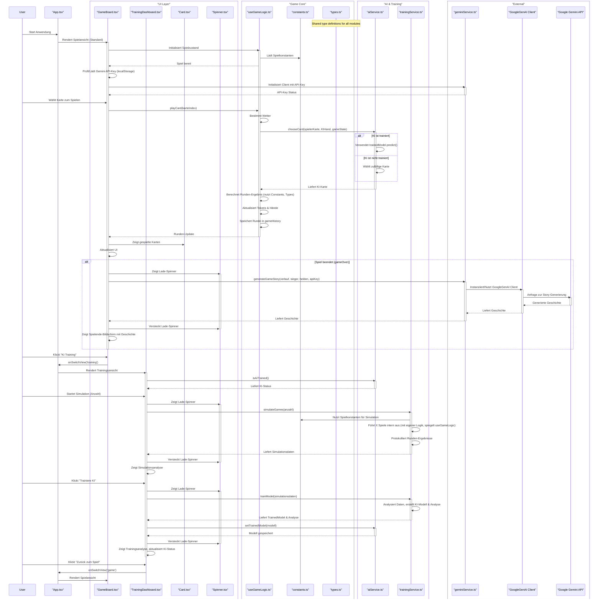

```mermaid
sequenceDiagram
    participant Benutzer as User
    participant App as "App.tsx"
    box "UI Layer"
        participant GameBoard as "GameBoard.tsx"
        participant TrainingDashboard as "TrainingDashboard.tsx"
        participant Card as "Card.tsx"
        participant Spinner as "Spinner.tsx"
    end
    box "Game Core"
        participant GameLogicHook as "useGameLogic.ts"
        participant Constants as "constants.ts"
        participant Types as "types.ts"
    end
    box "AI & Training"
        participant AIService as "aiService.ts"
        participant TrainingService as "trainingService.ts"
    end
    box "External"
        participant GeminiService as "geminiService.ts"
        participant GenAIClient as "GoogleGenAI Client"
        participant GeminiAPI as "Google Gemini API"
    end

    note over Types: Shared type definitions for all modules

    Benutzer->>App: Start Anwendung
    App->>GameBoard: Rendert Spielansicht (Standard)
    activate GameBoard
    GameBoard->>GameLogicHook: Initialisiert Spielzustand
    activate GameLogicHook
    GameLogicHook->>Constants: Lädt Spielkonstanten
    GameLogicHook-->>GameBoard: Spiel bereit

    GameBoard->>GameBoard: Prüft/Lädt Gemini API-Key (localStorage)
    GameBoard->>GeminiService: Initialisiert Client mit API-Key
    activate GeminiService
    GeminiService-->>GameBoard: API-Key Status
    deactivate GeminiService

    Benutzer->>GameBoard: Wählt Karte zum Spielen
    GameBoard->>GameLogicHook: playCard(karteIndex)
    GameLogicHook->>GameLogicHook: Bestimmt Wetter
    GameLogicHook->>AIService: chooseCard(spielerKarte, KIHand, gameState)
    activate AIService
    alt KI ist trainiert
        AIService->>AIService: Verwendet trainedModel.predict()
    else KI ist nicht trainiert
        AIService->>AIService: Wählt zufällige Karte
    end
    AIService-->>GameLogicHook: Liefert KI-Karte
    deactivate AIService
    GameLogicHook->>GameLogicHook: Berechnet Runden-Ergebnis (nutzt Constants, Types)
    GameLogicHook->>GameLogicHook: Aktualisiert Tokens & Hände
    GameLogicHook->>GameLogicHook: Speichert Runde in gameHistory
    GameLogicHook-->>GameBoard: Runden-Update
    deactivate GameLogicHook
    GameBoard->>Card: Zeigt gespielte Karten
    GameBoard->>GameBoard: Aktualisiert UI

    alt Spiel beendet (gameOver)
        GameBoard->>Spinner: Zeigt Lade-Spinner
        activate Spinner
        GameBoard->>GeminiService: generateGameStory(verlauf, sieger, helden, apiKey)
        activate GeminiService
        GeminiService->>GenAIClient: Instanziiert/Nutzt GoogleGenAI Client
        activate GenAIClient
        GenAIClient->>GeminiAPI: Anfrage zur Story-Generierung
        activate GeminiAPI
        GeminiAPI-->>GenAIClient: Generierte Geschichte
        deactivate GeminiAPI
        GenAIClient-->>GeminiService: Liefert Geschichte
        deactivate GenAIClient
        GeminiService-->>GameBoard: Liefert Geschichte
        deactivate GeminiService
        GameBoard->>Spinner: Versteckt Lade-Spinner
        deactivate Spinner
        GameBoard->>GameBoard: Zeigt Spielende-Bildschirm mit Geschichte
    end
    deactivate GameBoard

    Benutzer->>GameBoard: Klickt "KI Training"
    GameBoard->>App: onSwitchView('training')
    App->>TrainingDashboard: Rendert Trainingsansicht
    activate TrainingDashboard
    TrainingDashboard->>AIService: isAiTrained()
    activate AIService
    AIService-->>TrainingDashboard: Liefert KI-Status
    deactivate AIService

    Benutzer->>TrainingDashboard: Startet Simulation (Anzahl)
    TrainingDashboard->>Spinner: Zeigt Lade-Spinner
    activate Spinner
    TrainingDashboard->>TrainingService: simulateGames(anzahl)
    activate TrainingService
    TrainingService->>Constants: Nutzt Spielkonstanten für Simulation
    TrainingService->>TrainingService: Führt X Spiele intern aus (mit eigener Logik, spiegelt useGameLogic)
    TrainingService->>TrainingService: Protokolliert Runden-Ergebnisse
    TrainingService-->>TrainingDashboard: Liefert Simulationsdaten
    deactivate TrainingService
    TrainingDashboard->>Spinner: Versteckt Lade-Spinner
    deactivate Spinner
    TrainingDashboard->>TrainingDashboard: Zeigt Simulationsanalyse

    Benutzer->>TrainingDashboard: Klickt "Trainiere KI"
    TrainingDashboard->>Spinner: Zeigt Lade-Spinner
    activate Spinner
    TrainingDashboard->>TrainingService: trainModel(simulationsdaten)
    activate TrainingService
    TrainingService->>TrainingService: Analysiert Daten, erstellt KI-Modell & Analyse
    TrainingService-->>TrainingDashboard: Liefert TrainedModel & Analyse
    deactivate TrainingService
    TrainingDashboard->>AIService: setTrainedModel(modell)
    activate AIService
    AIService-->>TrainingDashboard: Modell gespeichert
    deactivate AIService
    TrainingDashboard->>Spinner: Versteckt Lade-Spinner
    deactivate Spinner
    TrainingDashboard->>TrainingDashboard: Zeigt Trainingsanalyse, aktualisiert KI-Status
    deactivate TrainingDashboard

    Benutzer->>TrainingDashboard: Klickt "Zurück zum Spiel"
    TrainingDashboard->>App: onSwitchView('game')
    App->>GameBoard: Rendert Spielansicht
```