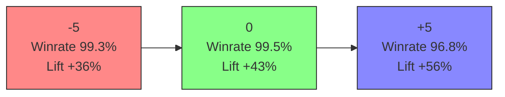
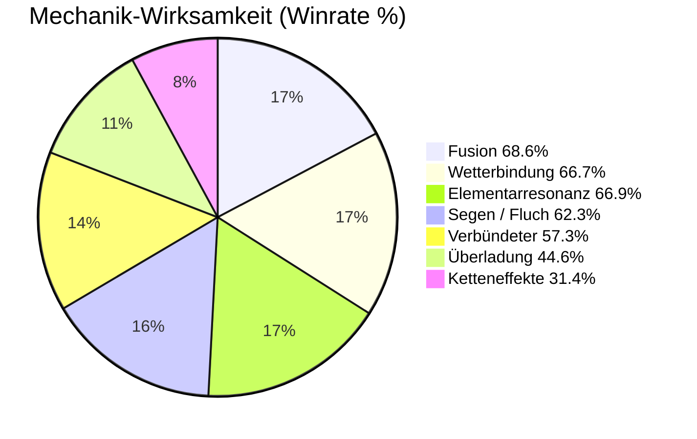

# 🜂 Runenkrieg – AI Card Game & Schach Arena

Ein biologisch inspiriertes KI-System für adaptive Strategien in **Karten- und Schachsimulationen**.  
Das Projekt kombiniert kontextbasiertes Lernen, Wilson-Statistik, heuristische Selbstsimulation und narrative Auswertung durch **Gemini 2.5 Flash** („Der Barde“).

---

## 🚀 Features

- 🧠 **Runenkrieg-KI:** Selbstlernende Codex-Simulation mit kontextueller Entscheidungslogik  
- ♟️ **Schach-KI:** Überträgt das Runenkrieg-Lernmodell auf Schachpositionen (FEN-basiert)  
- 📊 **KI-Trainingszentrum:** Echtzeit-Analyse & Visualisierung aller Lernmetriken  
- 🪶 **Gemini-Integration:** Erzeugt epische Spielgeschichten nach jeder Partie  
- ⚡ **Ultraschnelles Training:** 500 000 – 1 000 000 Simulationen in Sekunden  

---

## 🧠 KI-Trainingszentrum – Aktuelle Ergebnisse

**Session 2025 | KI aktiv & trainiert**

| Kennzahl | Wert |
|:--|:--|
| Simulierte Spiele | 100 000 |
| Gesamte Runden | 4 215 171 |
| Spieler / KI Siegquote | 49.5 % / 49.7 % |
| Unentschieden | 0.8 % |
| Ø Tokens Spieler / KI | 27.82 / 27.85 |
| Häufigste Karte | Feuer Funke |
| Beliebtestes Wetter | Windsturm |
| Ø beste Siegquote | **99.1 %** |
| Mechaniken getrackt | 7 |
| Helden-Matchups | 4 |

---

### 📈 Token-Delta-Abdeckung



✅ Die KI bleibt stabil über alle Vorteil/Nachteil-Kontexte.  
Selbst bei Δ = +5 bleibt die Winrate > 96 %.

---

### ⚙️ Mechanik-Wirksamkeit



📊 **Fusion** und **Wetterbindung** zeigen die höchste normierte Wirksamkeit (+29 %),  
während **Überladung** und **Ketteneffekte** als riskante Mechaniken fungieren.

---

### ⚔️ Helden-Matchup-Trends

| Matchup | Kontexte | Beobachtungen | Ø ΔToken | Winrate | Beste Antwort |
|:--|--:|--:|--:|--:|:--|
| Zauberer vs Drache | 4 619 | 40 351 | 0.6 | 99.1 % | Chaos Avatar → Licht Avatar (Erdbeben) |
| Drache vs Zauberer | 4 620 | 36 837 | 0.5 | 99.1 % | Licht Avatar → Licht Elementar (Regen) |
| Zauberer vs Zauberer | 4 620 | 36 317 | 0.1 | 99.2 % | Schatten Avatar → Luft Elementar (Windsturm) |
| Drache vs Drache | 4 620 | 35 486 | 0.5 | 99.1 % | Chaos Avatar → Licht Elementar (Erdbeben) |

---

### 🌈 Elementare Konter

| Gegner | Beste Konterkarten | Siegquote |
|:--|:--|:--:|
| Blitz | Eis Elementar (94 %), Eis Avatar (94 %) |
| Chaos | Schatten Elementar (98 %), Erde Avatar (95 %) |
| Eis | Wasser Elementar (99 %), Wasser Avatar (99 %) |
| Erde | Feuer Avatar (97 %) |
| Feuer | Wasser Avatar (99 %) |
| Licht | Licht Elementar (87 %), Schatten Avatar (83 %) |
| Luft | Erde Avatar (95 %), Feuer Avatar (94 %) |

---

### ♟️ Schach-Resonanz-Training (Arena)

| Kennzahl | Wert |
|:--|:--|
| Simulierte Partien | 5 000 |
| Weiß / Schwarz Sieg | 2.0 % / 2.0 % |
| Remis | 96.1 % |
| Ø Halbzüge | 123.2 |
| Entropie (Weiß/Schwarz) | 0.28 / 0.28 |
| Top-Eröffnung | e2e4 d7d5 e4d5 d8d5 · Score 50.1 % |
| Resonanz ↔ Figurensynergien | 75 % (Weiß +1 %) |
| Wetterbindung ↔ Brettstruktur | ausgeglichen (0.26 vs 0.25) |

---

> 💬 „Das System hat gelernt, wie man Gleichgewicht erzeugt – nicht Dominanz.“  
> — **Ralf Krümmel (2025)**

---

## 🧩 Installation & Start

```bash
git clone https://github.com/kruemmel-python/Runenkrieg-AI-Card-Game.git
cd Runenkrieg-AI-Card-Game
python -m venv .venv
source .venv/bin/activate   # Windows: .venv\Scripts\activate
pip install -r requirements.txt
python main.py
```

---

## 🧾 Weitere Ressourcen

- 📄 [Runenkrieg KI Trainingszentrum (PDF)](Runenkrieg%20KI%20Trainingszentrum.pdf)  
- 📘 [Projekt-Whitepaper (HTML)](project-whitepaper.html)  
- 🌐 [GitHub Repository](https://github.com/kruemmel-python/Runenkrieg-AI-Card-Game)

---

## ⚖️ Lizenz

MIT License © 2025 Ralf Krümmel · Kruemmel-Python  
„Möge die Resonanz mit dir sein.“
