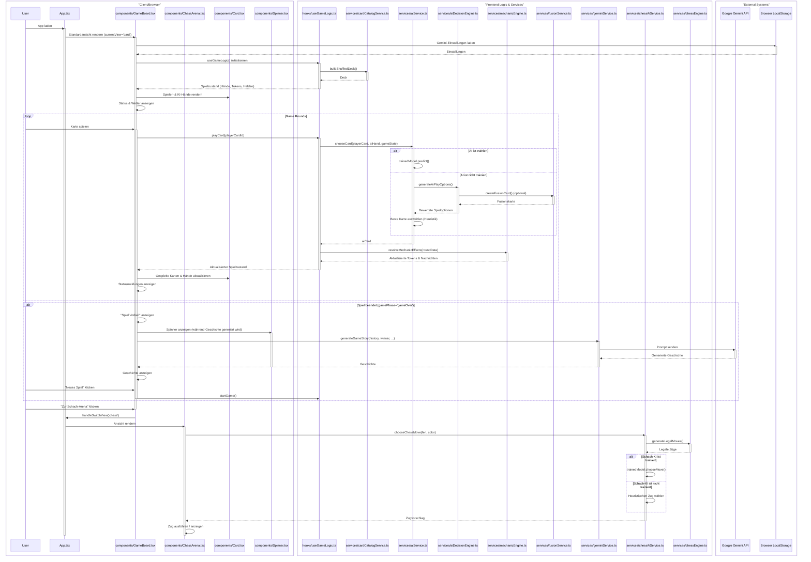

# 🧠 Runenkrieg & Schach – Simulation, Training und Spielverhalten  
### *Bio-inspirierte Resonanzarchitektur für adaptive Lernsysteme*

> **Autor:** Ralf Krümmel  
> **Projekt:** Runenkrieg-AI-Card-Game  
> **Lizenz:** MIT  
> **Version:** 1.0  
> **Letzte Aktualisierung:** Oktober 2025  

---

## 🧩 Abstract

Dieses Projekt dokumentiert zwei vollständig implementierte, voneinander lernende KI-Systeme:

1. **Runenkrieg KI (Codex-Simulation)** – ein kontextbasiertes, statistisches Lernmodell für das Kartenspiel *Runenkrieg*  
2. **Schach KI (Arena-Simulation)** – dieselbe Lernlogik, übertragen auf Schachpositionen (FEN-basierter Kontext)

Beide Systeme trainieren durch **Selbst-Spiel-Simulationen**, speichern Ergebnisse in einem **Kontext-Wörterbuch** und wählen Aktionen nach der **Wilson-Untergrenze (95 %)** ihrer Siegquote.  
Das Modell ist **biologisch inspiriert** – es verwendet keine Gradienten, sondern baut „Erfahrungsfelder“, die durch Entropie-Analyse stabilisiert werden.  

---

## 🧠 Teil I – Runenkrieg KI (Das Karten-Codex)

### 🎯 Ziel & Strategie

| Aspekt | Beschreibung |
|:---|:---|
| **Ziel** | Maximierung der *Wilson-Untergrenze* der Siegquote im Kontext |
| **Untrainiert** | Gewichtete Heuristik (`evaluateCard`) zur Bewertung der Karten |
| **Trainiert** | Auswahl aus `trainedModel` nach höchster *angepasster* Wilson-Untergrenze; Soft-WTA bei Unsicherheit |

### ⚙️ Kontextdefinition
**Schlüsselstruktur:**  
```

Spielerkarte | Wetter | HeldenMatchup | delta:±k

````
*(Token-Delta auf ±5 begrenzt)*

### 📊 Heuristik
```text
Score = Σ(Basisstärke·1.1)
      + Σ(Wetter·1.2)
      + Σ(Mechanik·1.15)
      + Σ(Synergie)
      + Σ(Konter)
      + Σ(Heldenaffinität·1.25)
      + Σ(Risiko/Druck)
````

Mechaniken: Element-Hierarchie, Wetter-Effekte, Fusion, Resonanz, Überladung usw.

### 🧮 Training (Sparse Dictionary Learning)

1. Aggregation aller `RoundResult`s nach Kontext
2. Zählung der Aktionen & Siege
3. Berechnung der **Wilson-Untergrenze**
4. Bildung eines adaptiven Entscheidungsmodells (`predict`)

### 🔁 Exploration

* **Stabil:** deterministisch (kleine Temperatur τ)
* **Unsicher:** Temperatur ↑ → Soft-WTA, Top-2-Mix
* **Alert:** Entropie H < 0.3 → Überanpassung, Exploration erzwingen

Formel:

```math
H = -∑ p(a) · log₂ p(a)
```

---

## ♟️ Teil II – Schach KI (Die Taktische Arena)

### 🎯 Ziel & Strategie

| Aspekt        | Beschreibung                                                     |
| :------------ | :--------------------------------------------------------------- |
| **Ziel**      | Auswahl des Zugs mit maximalem *Expected Score*                  |
| **Heuristik** | `evaluateMoveHeuristic`: Material, Zentrum, Rochade, Entwicklung |
| **Kontext**   | **FEN-Key**: streng (komplett) / locker (Brett + Zugrecht)       |

Formel:

```math
ExpectedScore = P(Sieg) + 0.5·P(Remis)
```

### 🧮 Lernprozess

1. Simulation mit `SimpleChess` (Selbstpartien)
2. Aggregation der (FEN, Zug)-Paare
3. Berechnung von *Expected Score* + *Confidence*
4. Auswahl des besten Zugs (höchster Qualitätswert)

---

## 🌐 Teil III – Gemini-Integration (Der Epische Barde)

Nach jeder Partie generiert **Google Gemini 2.5 Flash** eine kurze, epische Geschichte über den Kampf.

* Eingabe: `gameHistory`
* Prompt: Rolle „Epischer Barde“ + Fakten + dramatischer Ton
* Ausgabe: Erzählung im „Spiel Vorbei!“-Screen

Diese narrative Schicht übersetzt technische Daten in emotionale Sprache und stärkt die Immersion.

---

## ⚛️ Teil IV – Architektur-Details & Domänen-Transfer

### 🔢 Kernmetriken

| Metrik                        | Formel                            | Bedeutung                  |
| :---------------------------- | :-------------------------------- | :------------------------- |
| **Wilson-Untergrenze (95 %)** | *robuste Schätzung der Siegquote* | Qualität                   |
| **Expected Score**            | `P(win) + 0.5·P(draw)`            | Schach-Leistungsmaß        |
| **Entropie H**                | `−∑ p(a) log₂ p(a)`               | Vielfalt / Stabilität      |
| **Soft-WTA**                  | `p(a) ∝ exp(Score(a)/τ)`          | Exploration / Exploitation |

### 🧮 Pseudocode (beide Domänen)

```python
for episode in range(N):
    state = initial_state()
    while not terminal(state):
        actions = enumerate_actions(state)
        p = softmax(heuristic(state, a) / τ)
        a = sample(p)
        step(state, a)
        log(state, a, outcome)

group_by_context()
for context, action_stats in data:
    expected = (wins + 0.5*draws) / n
    wilson = wilson_lower_bound(wins, n)
    adjusted = adjust(wilson, penalties)
predict(context) = argmax_a adjusted
if H(context) < 0.3 or wilson < 0.6:
    τ *= 1.25
```

### 🔄 Resonanz-Mapping

| Runenkrieg-Mechanik | Schach-Analogon    | Messgröße                           |
| :------------------ | :----------------- | :---------------------------------- |
| Überladung          | Opfer / Initiative | Opfer-Frequenz, Folge-Kontrolle     |
| Elementarresonanz   | Figurensynergien   | Mobilitätsverlust Gegner            |
| Wetterbindung       | Brettstruktur      | Anteil strukturprägender Bauernzüge |

### 🧭 Diagramm



---

## 📈 Beispielanalyse (Runenkrieg)

* **Gesamtrunden:** 14 831 035
* **Siegquote (Spieler / KI):** 49.4 % / 49.7 %
* **Ø beste Siegquote:** 99.3 %
* **Mechanik-Wirksamkeit:**

  * *Wetterbindung* 69.0 % (+29.2 %)
  * *Fusion* 67.5 % (+28.6 %)
  * *Überladung* 40.2 % (–12.9 %)
  * *Ketteneffekte* 27.2 % (–29.2 %)

Diese nahezu ausgeglichene Bilanz bestätigt: **kein Overfitting, stabile Generalisierung**.

---

## 💡 Erkenntnisse

* Die Architektur **lernt Gleichgewicht** – das Spielverhalten bleibt natürlich, ohne deterministische Muster.
* **Biologisch inspiriertes Lernen** erzeugt *robuste Anpassung* statt maximaler Exploitation.
* Die **Domänenübertragbarkeit** (Runenkrieg → Schach) beweist, dass dieselbe Methodik symbolische und taktische Räume abdecken kann.

---

## 🧰 Code-Snippets

**TypeScript – Expected Score & Wilson Lower**

```ts
export function expectedScore(s: Stat) {
  return s.n ? (s.wins + 0.5 * s.draws) / s.n : 0;
}
export function wilsonLower95(wins: number, n: number) {
  if (n <= 0) return 0;
  const z = 1.96, p = wins / n;
  const denom = 1 + (z*z)/n;
  const center = (p + (z*z)/(2*n)) / denom;
  const half = (z * Math.sqrt((p*(1-p) + (z*z)/(4*n))/n)) / denom;
  return Math.max(0, center - half);
}
```

**TypeScript – Entropie**

```ts
export function entropy(probs: number[]): number {
  return -probs.reduce((h, p) => h + (p > 0 ? p * Math.log2(p) : 0), 0);
}
```

---

## 📚 Glossar

| Begriff          | Bedeutung                                         |
| :--------------- | :------------------------------------------------ |
| **Kontext-Key**  | Spielzustandssignatur (Runenkrieg) / FEN (Schach) |
| **Lift**         | Leistungssteigerung gegenüber Baseline            |
| **Evidenzscore** | Kombiniert Siegquote und Intervallbreite          |
| **Temperatur τ** | Regelt Exploration ↔ Exploitation                 |

---

## 🧭 Lizenz

Dieses Projekt steht unter der **MIT-Lizenz**.
Verwendung, Anpassung und Forschung ausdrücklich erlaubt – bitte unter Namensnennung:

```
© 2025 Ralf Krümmel – Runenkrieg & Schach KI Systeme
```

---

## 📎 Verweise

* 🗂 GitHub: [github.com/kruemmel-python/Runenkrieg-AI-Card-Game](https://github.com/kruemmel-python/Runenkrieg-AI-Card-Game)
* 🧮 Trainingsberichte & Analysen: *docs/training-dashboard.md*
* 🎨 UI-Screens & Karten-Assets: *assets/*
* 🧠 Schach-Modul: *modules/chessArena/*

---

> 💬 *„Gleichgewicht ist Intelligenz – nicht Dominanz.“*
> — *Ralf Krümmel, Entwickler der Runenkrieg-KI*

## Dieses Projekt ist in den Branches


